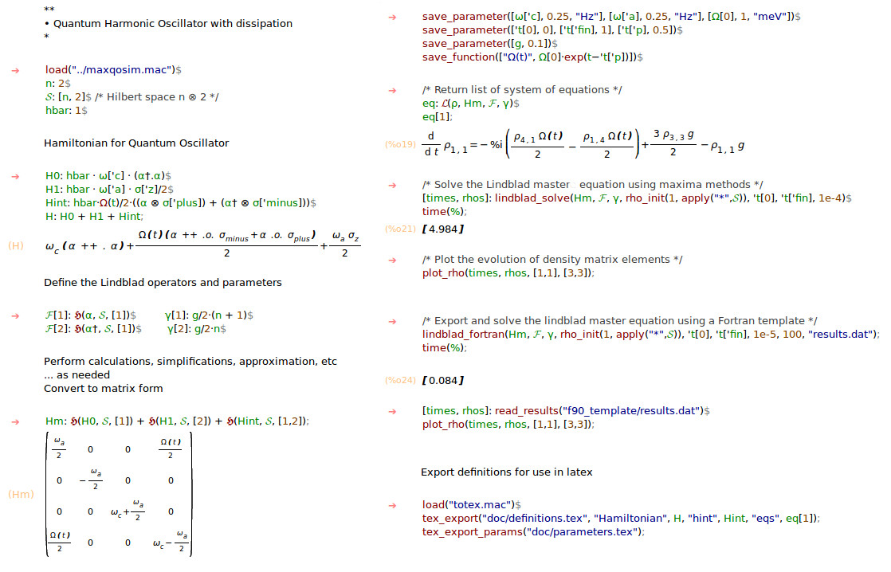
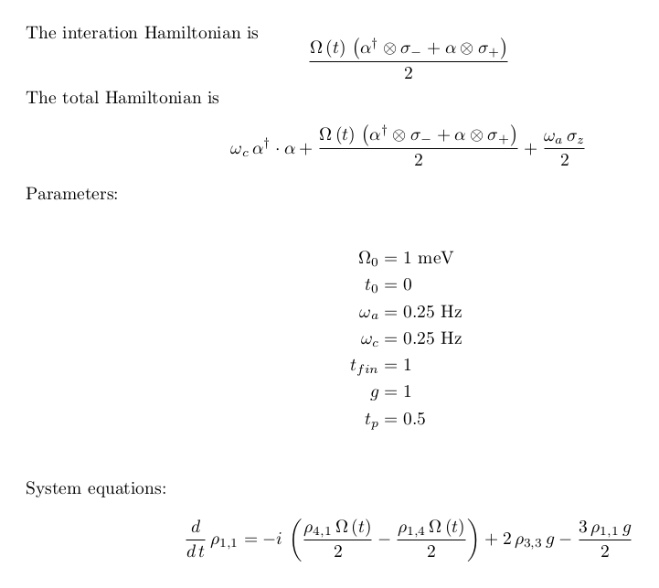

# maxqosim

`maxqosim` is a software package that facilitates the analysis and simulation
of quantum open systems, providing a framework where theoretical calculations,
efficient numerical calculations and exposition can be coordinated and
automated.
`maxqosim` consists of `Maxima` and `Fortran`  routines, revolving around the
symbolic manipulation of equations relevant to quantum open systems theory and
their efficient numerical simulation.
`maxqosim` package aims to be a tool for reproducible, extendable and efficient research
in quantum open systems.

**Publication:**
https://doi.org/10.1016/j.simpa.2020.100031

**Bib Record:**
```bibtex
@article{blekos2020efficient,
  title={Efficient and reproducible research in quantum open systems %
  	using Maxima with a Fortran interface},
  author={Blekos, Kostas},
  journal={Software Impacts},
  pages={100031},
  year={2020},
  publisher={Elsevier}
}
```

# Demo

## Maxima

Example maxima session:



## LaTeX

Using the maxima definitions above, the following tex file:

```tex
\documentclass{minimal}
\usepackage{amsmath}

\let\it\relax

\input{definitions}

\begin{document}

The interation Hamiltonian is \[ \hint{} \]

The total Hamiltonian is \[ \Hamiltonian{} \]

Parameters:

\input{parameters}

System equations: \[ \eqs{} \]
	
\end{document}
```

will compile to:


